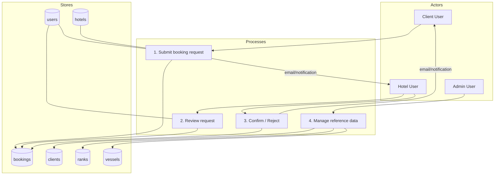

# HMS (Hotel Management System) — Project Overview + DFD

This project is a **multi-tenant (single DB, tenant-per-row)** hotel booking request system built with:

- Laravel 13 + Fortify (auth)
- Inertia v3 + React
- Wayfinder (typed routes for frontend)
- MySQL

## Roles (business)

- **Admin**: platform operator. Global scope (no `hotel_id`). Manages reference data (Clients, Ranks, Vessels).
- **Hotel**: hotel-side users. Must have `hotel_id`. Reviews/approves/rejects requests for their hotel only.
- **Client**: company/booker users. Must have `client_id`. Creates booking requests to hotels.

**Source of truth** for user role is `users.role` (enum-like string cast in the app).

## Tenancy & isolation rules

- **Hotel users**:
  - `users.role = hotel`
  - `users.hotel_id` is required (enforced by middleware `hotel.assigned`)
  - Can only access rows where `hotel_id = users.hotel_id`
- **Client users**:
  - `users.role = client`
  - `users.client_id` is required by business rules
  - Can only access their own requests (at minimum by `user_id`; later can expand by `client_id`)
- **Admin users**:
  - `users.role = admin`
  - Global visibility/management

## Core data stores (database tables)

High-level tables used by the HMS domain:

- **users**
  - `role` (admin | client | hotel)
  - `hotel_id` (nullable, required for hotel users)
  - `client_id` (nullable, required for client users)
- **hotels**
- **rooms** (kept for future / optional operational use; current booking request flow is roomless)
- **clients** (companies)
- **ranks** (reference list)
- **vessels** (reference list)
- **bookings** (booking requests; roomless)
- **roles** (reference list seeded with admin/client/hotel)

## Booking lifecycle (concept)

Bookings are created by **Client** users and sent to a **Hotel**.

- **Create request**
  - Status starts as `pending`
  - Captures guest fields + date range
  - `check_out_date` may be `NULL` meaning **OPEN** (still in hotel)
- **Hotel decision**
  - Hotel confirms (adds confirmation # + remarks)
  - or rejects (adds remarks)
  - Hotel sets **actual check-in/out** dates during approval

## DFD (Data Flow Diagram)

### Level 0 (Context)

```mermaid
flowchart LR
  Client[Client User (Company Booker)] -->|Create booking request| HMS[(HMS System)]
  HMS -->|Notify new request| Hotel[Hotel User]
  Hotel -->|Confirm / Reject| HMS
  HMS -->|Notify decision| Client
  Admin[Admin User] <--> |Manage reference data (clients/ranks/vessels)| HMS
```

### Level 1 (Main processes + stores)



## Code structure (where things live)

### Backend (Laravel)

- **Routes**
  - `routes/web.php`
    - `/` redirects to login
    - `/dashboard`
    - `/bookings/*` (client booking request flow)
    - `/admin/*` (admin-only reference modules: clients/ranks/vessels)
  - `routes/settings.php` (profile/security settings)

- **Controllers**
  - `app/Http/Controllers/BookingController.php`
  - `app/Http/Controllers/Admin/*`

- **Requests (validation)**
  - `app/Http/Requests/StoreBookingRequest.php`
  - `app/Http/Requests/StoreClientRequest.php`, `UpdateClientRequest.php`
  - `app/Http/Requests/StoreRankRequest.php`, `UpdateRankRequest.php`
  - `app/Http/Requests/StoreVesselRequest.php`, `UpdateVesselRequest.php`

- **Services**
  - `app/Services/BookingService.php` (creates booking requests)

- **Middleware**
  - `app/Http/Middleware/EnsureRole.php` (RBAC by role)
  - `app/Http/Middleware/EnsureHotelHasHotel.php` (enforces `hotel_id` for hotel users)
  - Middleware aliases live in `bootstrap/app.php`

- **Models**
  - `app/Models/Booking.php`, `Hotel.php`, `Room.php`
  - `Client.php`, `Rank.php`, `Vessel.php`

### Frontend (Inertia + React)

- **Pages**
  - `resources/js/pages/dashboard.tsx`
  - `resources/js/pages/bookings/*`
  - `resources/js/pages/admin/clients/*`
  - `resources/js/pages/admin/ranks/*`
  - `resources/js/pages/admin/vessels/*`
  - `resources/js/pages/auth/*`
  - `resources/js/pages/settings/*`

- **Layouts**
  - `resources/js/layouts/*`

- **Wayfinder typed routes**
  - Generated into `resources/js/routes/*`
  - Frontend imports use `@/routes/...`

## Current module map (what exists now)

- **Auth**: Fortify-based login/register/password reset/2FA/email verification.
- **Bookings (Client)**:
  - Create request (roomless)
  - List own requests
- **Admin reference modules**:
  - Clients CRUD
  - Ranks CRUD
  - Vessels CRUD

## Next modules to implement (planned)

- **Hotel approval workflow**
  - Hotel inbox (pending bookings for their hotel)
  - Confirm / Reject actions + notifications
- **Dashboards**
  - Different dashboards/analytics for Admin/Client/Hotel

