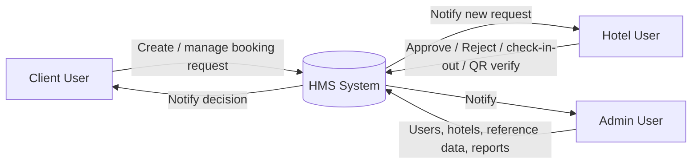
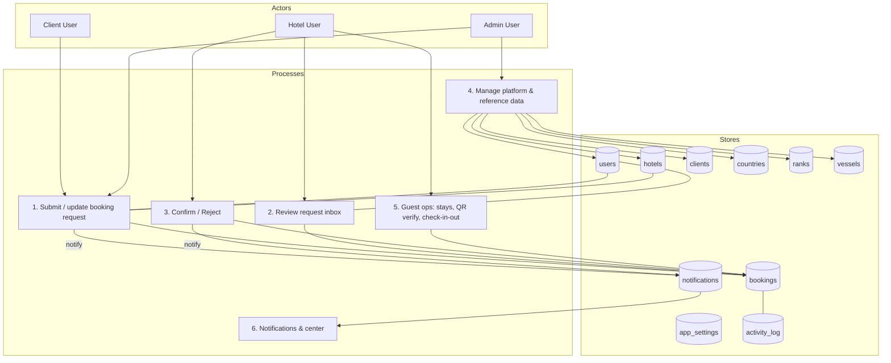

# HMS (Hotel Management System) — Project Overview + DFD

This project is a **multi-tenant (single DB, tenant-per-row)** hotel booking request system built with:

- Laravel 13 + Fortify (auth)
- Inertia v3 + React
- Wayfinder (typed routes for frontend)
- MySQL

## Roles (business)

- **Admin**: platform operator. Global scope (no `hotel_id`). Manages users, hotels, reference data (countries, clients, ranks, vessels), and booking reports.
- **Hotel**: hotel-side users. Must have `hotel_id`. Reviews/approves/rejects requests for their hotel only; operates guest check-in/out, QR scan flow, and stay list.
- **Client**: company/booker users. Must have `client_id`. Creates and manages booking requests to hotels.

**Source of truth** for user role is `users.role` (enum-like string cast in the app).

## Tenancy & isolation rules

- **Hotel users**:
  - `users.role = hotel`
  - `users.hotel_id` is required (enforced by middleware `hotel.assigned`)
  - Can only access rows where `hotel_id = users.hotel_id`
- **Client users**:
  - `users.role = client`
  - `users.client_id` is required by business rules
  - Bookings are scoped to the acting user (and associated client context on the booking)
- **Admin users**:
  - `users.role = admin`
  - Global visibility/management

## Core data stores (database tables)

High-level tables used by the HMS domain:

- **users** — `role` (admin | client | hotel), `hotel_id`, `client_id`, Fortify/2FA columns
- **hotels**
- **clients** (companies)
- **countries** (reference; used with clients and related UI)
- **ranks**, **vessels** (reference lists)
- **bookings** — roomless booking requests; status lifecycle; guest fields; optional open stay (`check_out_date` nullable); actual approval dates; optional `guest_check_in` / `guest_check_out` timestamps for on-site operations
- **roles** — reference list seeded with admin/client/hotel
- **notifications** — Laravel database notifications for in-app + optional mail
- **app_settings** — key/value JSON for application configuration
- **activity_log** — Spatie activity log for booking changes

There is **no** `rooms` table in the current schema; the flow remains roomless.

## Booking lifecycle (concept)

Bookings are created by **Client** users (and **Admin** can use the same booking UI) and sent to a **Hotel**.

- **Create request** — Status starts as `pending`; captures guest fields, client/rank/vessel, date range; `check_out_date` may be `NULL` for an open-ended stay.
- **Hotel decision** — Hotel confirms (confirmation #, remarks, actual check-in/out dates) or rejects (remarks). Status becomes `confirmed` or `rejected`.
- **On-site** — Hotel can record **guest check-in / check-out** timestamps on confirmed stays, use **QR scan** to verify a booking token, and list **stays** (in-house / operational views).

## Notifications

- Domain events enqueue **database** (and optionally **mail** when enabled per user) notifications.
- JSON endpoints under `notifications/*` and `notifications/unread-count` power the navbar bell (polling) and **Notifications Center** page. Client code that expects JSON should use **`fetch`** (or similar), not Inertia **`router.post`**, when the handler returns JSON only.

## DFD (Data Flow Diagram)

### Level 0 (Context)

### Level 1 (Main processes + stores)

## Code structure (where things live)

### Backend (Laravel)

- **Routes** — `routes/web.php` (app), `routes/settings.php` (profile, security, appearance, dashboard icon size, email notification preference)
- **Controllers (representative)**:
  - `App\Http\Controllers\BookingController` — client/admin booking CRUD
  - `App\Http\Controllers\Hotel\BookingInboxController` — hotel inbox approve/reject
  - `App\Http\Controllers\Hotel\StayController` — stays list and guest check-in/out
  - `App\Http\Controllers\Hotel\QrScanController`, `QrVerifyController` — QR flow
  - `App\Http\Controllers\DashboardController`, `OverviewController`
  - `App\Http\Controllers\NotificationsController`, `NotificationCenterController`
  - `App\Http\Controllers\Admin\*` — users, hotels, clients, countries, ranks, vessels, booking reports
- **Requests** — under `app/Http/Requests/` (bookings, admin resources, hotel approve/reject, etc.)
- **Services** — e.g. `app/Services/BookingService.php`
- **Middleware** — `EnsureRole`, `EnsureHotelHasHotel` (`hotel.assigned`); registered in `bootstrap/app.php`
- **Models** — `Booking`, `Hotel`, `User`, `Client`, `Country`, `Rank`, `Vessel`, `AppSetting`

### Frontend (Inertia + React)

- **Pages** — `resources/js/pages/` including `dashboard.tsx`, `overview.tsx`, `bookings/*`, `hotel/*`, `dashboards/*`, `notifications/*`, `admin/*`, `settings/*`, `auth/*`
- **Layouts** — `resources/js/layouts/*`
- **Wayfinder** — generated under `resources/js/routes/*` and `resources/js/actions/*`; import from `@/routes/` or `@/actions/`

## Current module map (implemented)

- **Auth** — Fortify login, register, password reset, 2FA, email verification.
- **Dashboards** — Role-specific dashboard pages (admin / client / hotel).
- **Overview** — Cross-role overview page.
- **Bookings (client + admin)** — Full CRUD on booking requests.
- **Hotel** — Booking inbox, approve/reject, **Scan QR**, **Stays** with guest check-in/out.
- **Admin** — Users, hotels, clients, countries, ranks, vessels; **booking reports** (list + export).
- **Notifications** — Database notifications, navbar unread polling, notifications center, mark read / read all.
- **Settings** — Profile, security, appearance, dashboard icon size, email notification toggle.

## Agent notes (see `AGENTS.md`)

- After adding or renaming routes, run Wayfinder generation so TypeScript stays in sync.
- For JSON-only web routes from React, prefer `fetch` + explicit handling over Inertia visits that expect an Inertia response.
